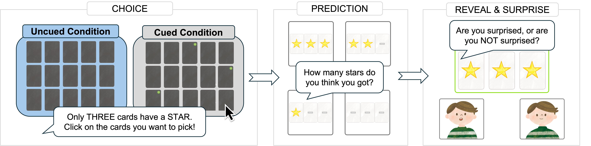

# Overoptimistic predictions and well-calibrated expectations: Children say they will achieve unrealistic outcomes but are surprised when they do

**Adani Abutto, Misha O'Keeffe, and Hyo Gweon** — CogSci 2026

---

Accurately predicting one's own performance outcomes is a
crucial skill for children and adults alike. Prior research, how-
ever, has shown that young children are notoriously overopti-
mistic, making predictions far beyond their actual performance.
Curiously, these findings contradict decades of work showing
that infants and children hold reasonable expectations about
the world, showing surprise—an indication of prediction er-
ror (PE)—when events violate their expectations. If children
have well-calibrated expectations about their own performance,
they might experience PE when they produce unrealistically
good outcomes. Using a probability-based game (Experiment
1, N=48) and a memory-based game (Experiment 2, N=64), we
show that preschoolers are indeed overoptimistic in their ex-
plicit predictions, but express surprise after achieving precisely
those unrealistic performance outcomes they predicted. These
results demonstrate an early-emerging sensitivity to prediction
error about the self, revealing a striking discrepancy between
what children say they can do and what they think they can do.

---

## methods



both experiments followed the same structure: kids chose cards, predicted how many stars they got, then saw the reveal and rated their surprise.

- **exp 1** (N=48): probability-based card game. two between-subjects conditions — Uncued (star locations unknown) vs. Cued (star locations marked). run on Lookit.
- **exp 2** (N=64): memory-based card game. same CHOICE → PREDICTION → REVEAL & SURPRISE structure. run on Lookit.

---

## repo structure

```
├── code
│   ├── experiments
│   │   ├── chance.js           # exp 1 Lookit protocol
│   │   └── memory.js           # exp 2 Lookit protocol
│   ├── python
│   │   └── preprocessing.py    # raw JSON → cleaned CSVs
│   └── R
│       └── analysis.Rmd        # main analyses + figures
├── data
│   ├── raw                     # identifiable raw data (not included)
│   ├── chance                  # cleaned exp 1 data
│   └── memory                  # cleaned exp 2 data
├── figures
│   ├── chance                  # exp 1 result plots
│   └── memory                  # exp 2 result plots
└── writeup
    └── overoptimisticpredictions_0202.pdf
```
